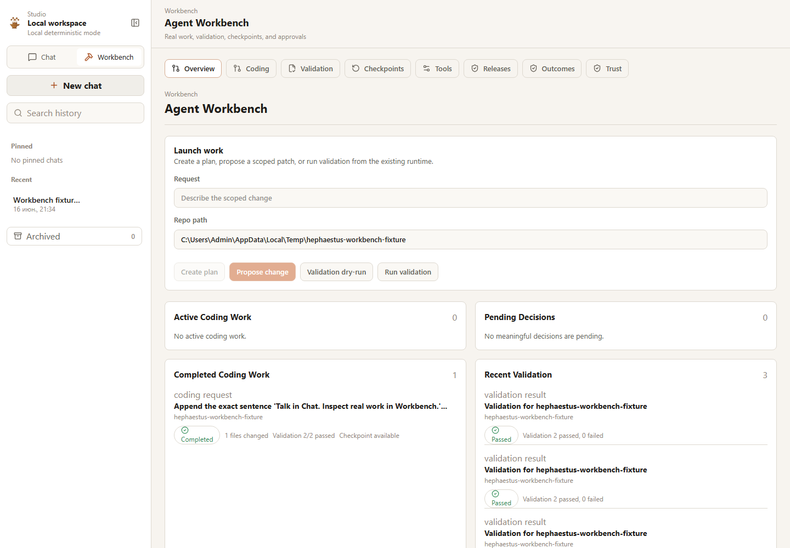

# Hephaestus

A self-improving AI agent for people building ambitious things.

Hephaestus remembers your context, helps you think, helps you code, validates
its work, and improves from real outcomes.

Today it can:

- talk with you using persistent project memory;
- inspect a repo;
- plan scoped repo changes;
- propose patches;
- apply approved patches with checkpoints;
- run real validation;
- record outcomes and learning signals.

It is early. It is not a fully autonomous background agent yet.

## Start Here

From a source checkout, prefix commands with `uv run`. After installation, the
console command is `heph`.

```bash
git clone https://github.com/dimadde39-del/Hephaestus.git hephaestus
cd hephaestus
uv sync
uv run heph doctor
```

Try the practical loop first:

```bash
heph ask "What is this project trying to become?"
heph discuss "Stress-test this roadmap." --mode strategic
heph validate run . --yes
```

DeepSeek V4 Flash has an opt-in, budgeted smoke path. These commands are
network-free until `--live` is added:

```bash
uv run heph models test deepseek
uv run heph models smoke deepseek --case conversation
uv run heph models smoke deepseek --case repo-read --repo .
uv run heph models smoke deepseek --case coding
```

See [DeepSeek V4 Flash](docs/deepseek_v4_flash.md) and
[live provider smoke](docs/live_provider_smoke.md). This smoke is deliberately
narrow and is not a Claude Code parity claim.

In a source checkout, those same commands are:

```bash
uv run heph ask "What is this project trying to become?"
uv run heph discuss "Stress-test this roadmap." --mode strategic
uv run heph validate run . --yes
```

## Hephaestus Studio

Talk in Chat.
Inspect real work in Workbench.
Control what Hephaestus remembers in Memory.

Studio is the local web interface for persistent Hephaestus conversations. It
shows the exact saved user and agent messages, lets you create, reopen, search,
pin, rename, and archive chats, and continues through the same conversation
system used by the CLI. It does not spend model tokens on an automatic recap
when a chat opens.

Workbench is the second Studio surface. It shows coding requests, plans, patch
diffs, validation evidence, checkpoints, rollback, tool actions, release
evidence, outcomes, and meaningful approvals without making the chat timeline a
dashboard.

Memory is the third Studio surface. It shows regular and strategic memories in
plain language, lets you create, edit, archive, restore, delete, and resolve
simple conflicts, and reviews memory suggestions before anything durable is
saved.

Settings covers local startup behavior, appearance, provider/model
configuration, trust policy, usage estimates, exports, backups, and restore.
Provider secrets are stored locally and are never returned by normal API
responses or exports.

```bash
uv sync --extra studio
uv run heph studio
uv run heph studio --no-open
uv run heph studio doctor
```

Installed package flow:

```bash
uv tool install "hephaestus[studio]"
heph studio
```

By default Studio binds to `http://127.0.0.1:8741`, uses the local SQLite
database at `.hephaestus/hephaestus.db`, and falls back to deterministic local
mode when no provider key is configured.



## What Works Today

| Capability | Status |
|---|---|
| Persistent conversations | Works |
| Strategic memory | Works |
| Repo inspection | Works |
| Safe local tools | Works |
| Real validation execution | Works |
| Repo-aware coding loop | Works for small scoped changes |
| Studio persistent chat | Works |
| Studio agent workbench views | Works |
| Studio memory management | Works |
| Studio provider/model settings | Works |
| Studio backup/export/restore | Works |
| Full autonomous coding | Not yet |
| Daemon / 24-7 runtime | Not yet |
| Voice | Later |

## Try The Current Loop

1. Inspect and talk:

```bash
heph ask "What release risks are visible in this repo?" --repo .
```

2. Validate:

```bash
heph validate run . --yes
```

3. Propose a code or docs change:

```bash
heph code propose "Update README wording to mention validation-backed release evidence." --repo .
```

4. Run the bounded coding loop:

```bash
heph code run "Update README wording to mention validation-backed release evidence." --repo . --dry-run
```

5. See results:

```bash
heph code results
```

Use `--yes` only when you want Hephaestus to apply an approved patch. Without
approval, the loop stays in planning, proposal, and dry-run mode.

## What Hephaestus Is Not Yet

Hephaestus is useful today, but it is still an alpha. It is not:

- a fully autonomous coding agent;
- a cloud or VPS daemon;
- a voice or Jarvis-style assistant;
- a browser automation agent;
- a replacement for mature coding tools;
- an uncontrolled self-modifying system.

It does not deploy, publish, push, perform destructive actions, or run broad
multi-file rewrites on its own. Local side effects require explicit approval.

## Why Care?

Most AI coding tools can answer questions and generate code. Hephaestus is
focused on the surrounding loop:

```text
context -> plan -> patch -> validate -> outcome -> memory
```

The point is not that the model is bigger. The point is that the agent around
the model remembers what happened, keeps evidence, and makes future work less
forgetful.

That means you can come back later and inspect the project context, the previous
conversation, the proposed patch, the validation result, the checkpoint, and the
learning signal that came out of a success or failure.

## Why Not Just Use ChatGPT Or Claude Code?

Use them. They are excellent models and coding tools.

Hephaestus is different because it wraps model calls inside a local agent loop:

```text
context -> plan -> patch -> validate -> outcome -> memory
```

The goal is not to replace the model. The goal is to make the agent around the
model remember, verify, and improve.

## Why not Hermes?

Hermes is not the enemy. Hermes proved that people want self-improving agents
that remember them, grow with them, and carry work forward across time.

Hephaestus is built from the same belief, but with a different center of
gravity. It focuses on evidence-backed work: repo-aware coding, validation,
outcomes, learning, checkpoints, and decision-quality improvement.

```text
Hermes learns workflows.
Hephaestus learns why workflows succeed, then forges better ones.
```

Hephaestus is still early. It does not yet have full always-on companion
features, voice, or a long-running background runtime. The long-term goal is a
self-improving agent that can think with you, work on your repo, validate what
happened, and improve from real outcomes.

| System | Center of gravity |
|---|---|
| Hermes | Self-improving personal/workflow agent |
| Claude Code / Codex-style tools | Strong coding assistance inside a repo |
| Hephaestus | Self-improving agent with validation-backed coding and outcome learning |

## Why This Is Not Architecture Theater

Early Hephaestus versions were deliberately planning-heavy. That made the
decision engine, traces, and learning artifacts inspectable, but it also made
the public story too easy to mistake for a CLI science fair project.

That boundary has changed. Hephaestus now has real local validation execution
and a repo-aware coding loop for small scoped changes. Evidence can come from
actual commands, not only simulated outcomes.

It is still early and intentionally bounded. The advanced internals exist to
support practical agent behavior: remembering context, proposing scoped work,
validating it, recording what happened, and improving the next loop.

## Useful Commands

Basic conversation and validation:

```bash
heph studio
heph ask "What is this project trying to become?"
heph discuss "Stress-test this roadmap." --mode strategic
heph validate run . --yes
```

Repo-aware coding:

```bash
heph code plan "Update README wording to mention validation-backed release evidence." --repo .
heph code propose "Update README wording to mention validation-backed release evidence." --repo .
heph code run "Update README wording to mention validation-backed release evidence." --repo . --dry-run
heph code results
```

Advanced release planning:

```bash
heph release plan . --pareto --qubo --evaluate
heph release plan . --pareto --qubo --with-validation --yes
heph release list
heph release show <release_plan_id>
heph explain <run_id>
heph pareto list
heph qubo list
heph learn signals
```

From a source checkout:

```bash
uv run heph --help
uv run heph doctor
uv run heph models
uv run heph policy set developer
uv run heph validate run . --dry-run
uv run heph code run "Update README wording to mention validation-backed release evidence." --repo . --dry-run
uv run heph release plan . --pareto --qubo --evaluate
uv run heph release plan . --pareto --qubo --with-validation --yes
```

## Advanced Engine

Under the hood, Hephaestus includes machinery for inspecting decisions and
tradeoffs. This is useful for technical users, but it is not the first thing a
normal user needs to care about.

For complex tradeoffs, Hephaestus can compare options instead of blindly taking
the first plausible path.

Advanced internals include:

- decision traces for selected and rejected options;
- Pareto frontiers for comparing tradeoffs;
- QUBO and Ising formulations for inspectable binary optimization problems;
- policy profiles for user-owned execution boundaries;
- strategic memory for durable goals, assumptions, decisions, and lessons;
- model routing and context packing.

QUBO here means local classical optimization over binary variables. It is not a
quantum hardware claim.

## Technical Spine

```text
repo intelligence
-> conversation memory
-> safe tool runtime
-> repo-aware coding loop
-> real validation
-> outcomes
-> learning
```

The current architecture is local-first and approval-gated:

```text
CLI
 |-- Studio: local web UI for exact persistent chat and Workbench inspection
 |-- Conversation: ask/discuss/chat over memory, repo context, and deliberation
 |-- Strategic memory: goals, principles, assumptions, decisions, and lessons
 |-- Repo intelligence: read-only local inspection and command risk classification
 |-- Policy profiles: transparent boundaries for local work and side effects
 |-- Tool runtime: safe file tools, shell gates, patches, checkpoints, observations
 |-- Validation: repo-derived lint/test/typecheck/build execution through safe tools
 |-- Coding loop: scoped plans, patch review, approved apply, validation, rollback
 |-- Release planning: conservative recommendations and validation evidence
 |-- Advanced engine: decision traces, Pareto, QUBO, routing, outcomes, learning
 `-- Storage: local SQLite state in .hephaestus/hephaestus.db
```

For the deeper module map, see [docs/architecture.md](docs/architecture.md).

## Current Status

Built:

- Python 3.12 package with a Typer/Rich CLI.
- SQLite persistence for memory, runs, tasks, decisions, approvals, validation,
  coding-loop artifacts, and release plans.
- Persistent conversations with deterministic local mode and optional DeepSeek
  or OpenAI-compatible provider synthesis.
- Strategic memory for durable goals, ambitions, principles, constraints,
  assumptions, decisions, rejected paths, lessons, and open questions.
- User-owned policy profiles with visible boundaries and approval gates.
- Safe local tool runtime for file list/read/search, command dry-runs, safe
  command execution, patch proposals, checkpoints, rollback, observations, and
  trace links.
- Real validation execution for repo-derived lint, test, typecheck, build,
  format-check, security-check, and custom validation commands.
- Repo-aware coding loop for small scoped changes: plan, propose, review, apply
  with `--yes`, checkpoint, validate, optionally rollback, and record outcomes.
- Local Studio persistent chat UI with searchable exact-message history,
  conversation metadata, mode/repo selectors, provider status, policy context,
  and a Workbench for inspecting real agent work.
- Studio Workbench views for coding requests, diffs, validation runs,
  checkpoints, tool actions, release evidence, outcomes, trust settings, and
  meaningful pending approvals.
- Release planning with optional validation evidence.
- Advanced decision machinery: traces, outcomes, learning signals, Pareto
  frontiers, QUBO formulations, local solvers, model routing, and context
  packing.

Not built yet:

- Fully autonomous code editing.
- Large architecture rewrites or unbounded multi-file self-editing.
- Deploy, publish, push, or destructive command execution.
- A long-running daemon or cloud worker.
- Browser, desktop, Telegram, or voice automation.
- Production sandbox execution.
- Quantum hardware integration.

Release planning can still run deterministic simulated outcome evaluation with
`--evaluate`. When `--with-validation --yes` is used, it also runs the repo
validation plan through the safe tool runtime and labels readiness as real
validation evidence instead of simulated evidence.

## More Docs

- [Product positioning](docs/product_positioning.md)
- [README reality checklist](docs/readme_reality_checklist.md)
- [Roadmap](docs/roadmap.md)
- [Release evidence](docs/release_evidence.md)
- [Repo-aware coding loop](docs/repo_aware_coding_loop.md)
- [Studio](docs/studio.md)
- [Studio architecture](docs/studio_architecture.md)
- [Studio chat history](docs/studio_chat_history.md)
- [Studio Workbench](docs/studio_workbench.md)
- [Studio trust and approvals](docs/studio_trust_and_approvals.md)
- [DeepSeek V4 Flash](docs/deepseek_v4_flash.md)
- [Live provider smoke](docs/live_provider_smoke.md)
- [Public launch notes](docs/public_launch_notes.md)
- [Reveal strategy](docs/reveal_strategy.md)
- [Demo script](docs/demo_script.md)
- [Contributor guide](docs/contributor_guide.md)

## Development

```bash
uv sync --extra dev
uv run ruff format .
uv run ruff check .
uv run pytest
uv run mypy
uv run heph doctor
uv run heph studio doctor
uv run heph validate run . --dry-run
uv run heph code run "Update README wording to mention validation-backed release evidence." --repo . --dry-run
uv run heph release plan . --pareto --qubo --with-validation --yes
```

Contributors should start with [CONTRIBUTING.md](CONTRIBUTING.md) and
[docs/contributor_guide.md](docs/contributor_guide.md). The short version:
improve the loop that helps Hephaestus remember, reason, propose scoped work,
validate outcomes, and learn from evidence.
