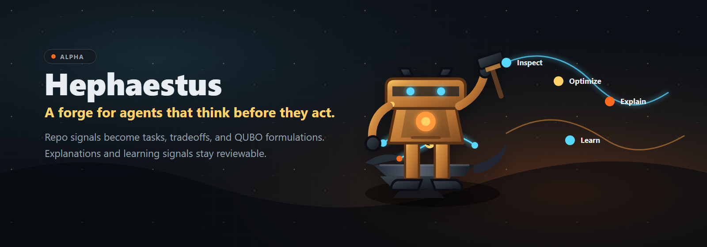
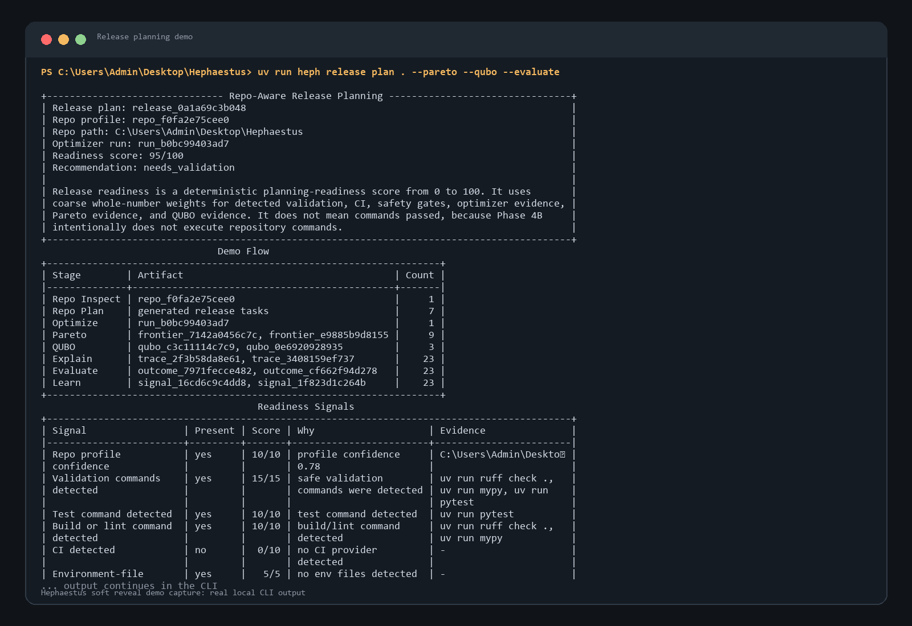

# Hephaestus



**Optimization-first agent OS with explainable decisions and learning memory.**

Status: **early alpha, local-first, approval-gated**. Hephaestus can inspect a
repository, build a release-readiness plan, expose tradeoffs, formulate decision
problems, explain why choices were made, evaluate deterministic simulated
outcomes, create learning signals, and answer text discussions through
`heph ask`, `heph discuss`, and `heph chat`. Conversations run in deterministic
local mode by default and can use configured DeepSeek or OpenAI-compatible
providers for one-call synthesis with budget visibility. User-owned policy
profiles keep benign creative, development, research, and strategy work
practically free while preserving approval gates for side effects. Phase 5E adds
a safe local tool runtime for file inspection, dry-run command planning, safe
validation commands, patch proposals, checkpointed patch application, and
rollback. It does **not** edit code autonomously, run as a daemon, deploy,
publish, push, or claim production-ready autonomy.

```text
The forge for agents that think before they act.
```

## Demo First

```bash
git clone https://github.com/dimadde39-del/Hephaestus.git hephaestus
cd hephaestus
uv sync
uv run heph doctor
uv run heph models
uv run heph release plan . --pareto --qubo --evaluate
```

Expected high-level flow:

```text
Repo inspected
Release tasks generated
Pareto tradeoffs compared
QUBO problems formulated
Decision traces saved
Outcomes evaluated
Learning signals created
```



Then inspect the artifacts:

```bash
uv run heph ask "What is Hephaestus trying to become?" --show-budget
uv run heph policy set developer
uv run heph policy evaluate "make a README banner for my AI project"
uv run heph discuss "Stress-test launching before code execution exists." --mode strategic --show-context
uv run heph discuss "Research plan: compare Hephaestus positioning against open-source agent frameworks." --mode research
uv run heph policy benchmark run
uv run heph tools list .
uv run heph tools run "python --version" --dry-run
uv run heph tools run "python --version" --yes
uv run heph discuss "Propose a safe validation plan for this repo." --repo . --propose-tools
uv run heph conversation benchmark list
uv run heph conversation benchmark run benchmarks/conversation/idea_stress_test.json
uv run heph strategy memory add --type goal --content "Build Hephaestus toward a 20k-star open-source project."
uv run heph strategy context
uv run heph release list
uv run heph release show <release_run_id>
uv run heph runs
uv run heph explain <optimizer_run_id>
uv run heph pareto list
uv run heph qubo list
```

See the full [release plan walkthrough](examples/release_plan_demo.md), the
[demo screenshot pack](docs/assets/demo/README.md), and the
[60-90 second demo script](docs/demo_script.md) for a concise tour of what each
stage means, which parts are real, and which parts are simulated in the current
alpha.

## What It Is

Hephaestus is a Python 3.12 agent runtime foundation built around decision
quality. Ordinary agents often jump from prompt to action. Hephaestus starts by
making the decision problem explicit: inspect the repo, generate tasks, compare
plans, surface tradeoffs, explain selections, record outcomes, and turn failures
into reviewable learning artifacts.

The current public demo is intentionally conservative:

```text
Repo -> Profile -> Tasks -> Optimizer -> Pareto -> QUBO -> Explain -> Outcomes -> Learning Profiles
```

In one sentence:

```text
Hermes learns workflows.
Hephaestus learns decision quality.
```

## Why It Is Different

- **Decision traces are first-class.** The system records selected options,
  rejected alternatives, constraints, metrics, confidence, and rationale.
- **Planning is optimization-shaped.** Task ordering, model routing, context
  packing, and budget checks flow through explicit objective functions.
- **Tradeoffs are visible.** Pareto frontiers show quality, cost, latency, risk,
  privacy, token usage, safety, and profile alignment instead of hiding
  everything behind one score.
- **QUBO/Ising is inspectable.** Binary variables, objectives, constraints, and
  local solver results make selected decision problems concrete. This is
  classical local solving, not a quantum hardware claim.
- **Learning is reviewable.** Outcomes create reflections, learning signals,
  failure memory drafts, and policy profile suggestions before anything can
  bias future decisions.
- **Repo intelligence grounds the plan.** The demo reads real local repo signals
  such as manifests, lockfiles, scripts, CI config, env file names, and command
  risk categories before planning.
- **Conversation is deliberative.** `ask`, `discuss`, and `chat` classify the
  discussion, retrieve memory/repo context, run internal deliberation passes,
  suggest memory updates, and trace high-impact strategy or architecture calls.
- **Strategic memory is explicit.** Goals, ambitions, principles, roadmap
  decisions, rejected paths, assumptions, and open questions can shape future
  discussions, but conversation-derived updates are only saved with
  `--save-memory`, `--save-strategy`, or chat `/save-memory`.
- **Discussion quality is rubric-backed.** Stress tests, business strategy,
  product strategy, architecture, roadmap, research planning, and risk analysis
  use explicit checks so Hephaestus helps the user think better instead of just
  replying.
- **Conversation quality is measurable.** Model-backed synthesis routes through
  provider profiles, prompt assembly, context budgets, and deterministic
  conversation benchmarks that do not require paid APIs.
- **Freedom UX is configurable.** Policy profiles such as `developer`,
  `research`, `local_power_user`, `strict`, and `balanced` make boundaries
  transparent without turning benign work into a refusal ritual.

## Current Status

Built:

- Pydantic v2 schemas and a Typer/Rich CLI.
- SQLite persistence for memory, runs, tasks, decisions, approvals, and release
  planning artifacts.
- Optimizer baselines, model routing, context packing, and token budget checks.
- Benchmark proof reports.
- Explainable decision traces.
- Outcome tracking, reflections, learning signals, and failure memory drafts.
- Decision quality profiles with explicit activation/archive.
- Pareto tradeoff frontiers and preference profiles.
- QUBO formulations, local solvers, and QUBO to Ising conversion.
- Read-only repo intelligence and repo-aware release planning.
- Conversational text interface with deliberation modes, memory suggestions,
  repo context, persisted sessions, and high-impact decision traces.
- Strategic memory for durable goals, ambitions, principles, constraints,
  assumptions, decisions, rejected paths, lessons, and open questions.
- Discussion-quality rubrics and research planning mode.
- Real-provider conversation routing for DeepSeek and OpenAI-compatible APIs,
  including OpenRouter-style endpoints through the OpenAI-compatible path.
- Prompt assembly with behavior/policy standards, deliberation mode, rubrics,
  regular memory, strategic memory, repo context, session context, and context
  trimming.
- Conversation budget reporting and deterministic conversation benchmarks.
- User-owned policy profiles with SQLite-backed active profile state,
  deterministic request evaluation, over-refusal detection, policy benchmarks,
  and `heph policy` commands.
- Safe local tool runtime for file list/read/search, command dry-runs, safe
  command execution, patch proposals, checkpointed patch application, rollback,
  observations, approvals, and trace/outcome links.

Not built yet:

- Autonomous code edits.
- Autonomous execution of full repository validation plans.
- Deploy, publish, push, or destructive command execution.
- A long-running daemon.
- A dashboard.
- Browser, desktop, Telegram, or voice automation.
- Production sandbox execution.
- Quantum hardware integration.

Release-planning outcomes are still deterministic simulations over decision
traces. Tool runtime commands can now produce real command outcomes separately,
but Phase 5F is the planned bridge that turns validation plans into
evidence-backed release learning.

## Core Loop

```text
Inspect -> Specify -> Optimize -> Explain -> Evaluate -> Learn -> Execute safely with approval
```

Architecture at a glance:

```text
CLI
 |-- Conversation: ask/discuss/chat over memory, repo context, and deliberation
 |-- Policy profiles: user-owned freedom modes, boundaries, and over-refusal checks
 |-- Strategic memory: long-term goals, principles, assumptions, decisions, and context
 |-- Discussion quality: rubrics for stress tests, strategy, architecture, roadmap, and research
 |-- Repo intelligence: read-only local inspection and command risk classification
 |-- Tool runtime: safe file tools, shell gates, patches, checkpoints, observations
 |-- Release planning: demo orchestration and conservative recommendations
 |-- Optimization core: scheduling, routing, context packing, token budget checks
 |-- Pareto layer: multi-objective candidate frontiers and selections
 |-- QUBO layer: binary formulations, local solvers, Ising conversion
 |-- Decision layer: persisted traces and explanation rendering
 |-- Outcome layer: deterministic evaluations, reflections, learning signals
 |-- Policy learning: reviewable decision quality profiles
 |-- Memory layer: local persistent memories
 `-- Safety layer: approval gates and risk policy schemas
```

For the deeper module map, see [docs/architecture.md](docs/architecture.md).
For phase history and upcoming work, see [docs/roadmap.md](docs/roadmap.md).
For the soft reveal materials, see [docs/public_launch_notes.md](docs/public_launch_notes.md),
[docs/reveal_strategy.md](docs/reveal_strategy.md), and
[docs/soft_reveal_checklist.md](docs/soft_reveal_checklist.md).

## Useful Commands

```bash
uv run heph --help
uv run heph doctor
uv run heph policy profiles
uv run heph policy set developer
uv run heph policy evaluate "make a README banner for my AI project"
uv run heph ask "What is Hephaestus trying to become?"
uv run heph discuss "Stress-test launching before code execution exists." --mode strategic
uv run heph ask "What context is shaping this?" --show-context
uv run heph discuss "Research plan: compare Hephaestus positioning against existing open-source agent frameworks." --mode research
uv run heph strategy memory add --type goal --content "Build Hephaestus toward a 20k-star open-source project."
uv run heph strategy memory search "20k"
uv run heph strategy context
uv run heph ask "What are the release risks in this repo?" --repo .
uv run heph conversations
uv run heph repo inspect .
uv run heph release plan . --pareto --qubo --evaluate
uv run heph release list
uv run heph runs
uv run heph explain <run_id>
uv run heph explain <run_id> --summary
uv run heph pareto list
uv run heph qubo list
uv run heph learn signals
uv run heph policy benchmark run
```

By default, local state is stored in:

```text
.hephaestus/hephaestus.db
```

Optional DeepSeek API calls are disabled unless `DEEPSEEK_API_KEY` is set. Tests
and the public demo do not require paid APIs.

## Development

```bash
uv sync --extra dev
uv run ruff format .
uv run ruff check .
uv run pytest
uv run mypy
uv run heph doctor
uv run heph release plan . --pareto --qubo --evaluate
```

Contributors should start with [CONTRIBUTING.md](CONTRIBUTING.md) and
[docs/contributor_guide.md](docs/contributor_guide.md). The short version:
focus on core decision quality, repo-aware planning, explainability, learning
memory, and safe execution foundations. Voice, dashboards, random integrations,
and always-on automation are intentionally later.
