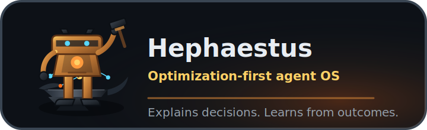

# Brand Direction

Hephaestus is an optimization-first agent OS for explainable decisions and
learning memory.



## Brand Idea

Hephaestus should feel like a forge for decisions:

- Practical, not mystical.
- Careful, not timid.
- Technical, but readable.
- Honest about limits.
- Built for people who want agents to justify choices before taking action.

Core line:

```text
The forge for agents that think before they act.
```

Long-form positioning:

```text
Hephaestus inspects a repo, builds a plan, exposes tradeoffs, formulates
decision problems, explains why choices were made, evaluates outcomes, and
turns mistakes into reviewable learning signals.
```

In short:

```text
Hermes learns workflows.
Hephaestus learns decision quality.
```

## Tone

Use:

- Clear engineering language.
- Short explanations before deep detail.
- Honest alpha caveats.
- Concrete nouns: repo profile, task graph, decision trace, Pareto frontier,
  QUBO problem, learning signal.
- Confidence without hype.

Avoid:

- "Autonomous" unless describing future work.
- "Quantum speedup" or anything implying quantum hardware.
- "AGI" positioning.
- Competitor dunking.
- Mascot-driven cuteness before the core is credible.
- Feature piles that make the project feel like disconnected AI buzzwords.

## Talos Mascot

Mascot concept:

```text
Talos, a small bronze forge automaton.
He forges decision graphs on an anvil.
```

Talos should communicate craft, patience, precision, and durable engineering.
He is a helper for explaining the decision forge, not the main product claim.

Guidelines:

- Original visual direction only.
- No copyrighted style references.
- Do not copy the Hermes girl concept or any existing AI mascot.
- Keep him small, bronze, warm, and tool-oriented.
- Use him sparingly until the core demo is strong.

The current asset pack interprets Talos as a compact bronze/iron automaton with
glowing eyes, a warm core, a small forge hammer, an anvil, and a restrained
decision graph motif. He is friendly enough to be memorable, but still belongs
to a developer tool.

## Visual System

The visual direction is:

- Dark charcoal and iron surfaces.
- Bronze craftsmanship as the primary warmth.
- Ember and forge gold for heat and emphasis.
- A subtle cyan accent only for graph/explainability signals.
- Clean geometry, readable type, and minimal ornament.

Avoid fantasy poster art, generic AI brains, floating robot orbs, copied mascot
styles, and overly cute character treatment.

The palette source lives in [assets/brand/palette.md](assets/brand/palette.md).

## Asset Inventory

Brand assets live in `docs/assets/brand/`.

| Asset | Purpose |
| --- | --- |
| `hephaestus-brand-board.png` | Source brand board for the current high-fidelity raster crops. |
| `hephaestus-social-preview.png` | GitHub social preview image with project name, tagline, Talos, and the release-planning pipeline. |
| `hephaestus-social-preview.svg` | Crop-source SVG that references `hephaestus-brand-board.png`. |
| `hephaestus-readme-hero.png` | Wide README hero used near the top of the repository README. |
| `hephaestus-readme-hero-source.png` | Source image for the current README banner. |
| `hephaestus-readme-hero.svg` | Source-image SVG wrapper for the current README banner. |
| `talos-pixel.png` | 64x64 pixel mascot crop for docs, social posts, or future CLI splash experiments. |
| `talos-pixel-4x.png` | 256x256 nearest-neighbor export of the pixel mascot. |
| `talos-icon.svg` | Compact Talos robot-head icon for future avatar/favicon use. |
| `talos-mark.svg` | Minimal anvil plus decision-graph mark for larger brand placements. |
| `talos-badge.svg` | Horizontal badge used in this brand guide. |
| `palette.md` | Core brand colors and usage notes. |

## Regenerating Assets

Run:

```bash
uv run python scripts/brand/generate_brand_assets.py
```

The generator uses only the Python standard library. When
`hephaestus-brand-board.png` is present, it extracts the social preview, README
hero, and pixel mascot from that board through local PowerShell/.NET image
APIs. It also writes the SVG crop sources, vector icon/mark/badge, and palette.
If the board is missing, it falls back to deterministic code-generated SVG and
PNG assets.

If `hephaestus-readme-hero-source.png` is present, it takes precedence for the
README hero banner.

## Future Visual Expansion

Useful next visual assets, when they support the public reveal:

- A restrained terminal demo card showing real CLI output.
- A simple architecture card based on the existing README diagram.
- A few social update images that reuse Talos and the decision graph motif.
- Optional small CLI splash using `talos-pixel.png`, only when it serves the
  developer experience.
