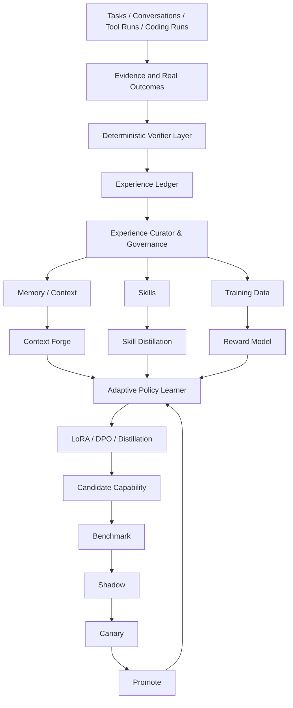

# Learning Stack

Hephaestus is a model-agnostic intelligence harness. The model supplies raw
intellectual potential; the harness turns that potential into checked work by
adding context, planning, tools, validation, repair, outcome evidence, and
learning.

The primary benchmark is:

```text
same model without Hephaestus vs same model with Hephaestus
```

Phase 5.6B makes this measurable through a frozen four-arm DeepSeek protocol
with deterministic hidden validators. It reports raw metrics and harness deltas
without collapsing cost, latency, exact pass, hidden pass, false success, and
infrastructure failures into one claim.

Protocol 5.6B.5 showed a useful negative result: Hephaestus had zero false
successes but no exact passes and no verifier-adjusted score gain over either
bare arm. MiMo-Code achieved 4/8 exact passes at substantially higher resource
use. Verification improved outcome honesty here; it did not by itself improve
implementation quality.

This does not mean a weaker model always beats a stronger one. It means that on
bounded tasks, a good harness can sometimes let a weaker model outperform a
stronger model that lacks comparable context, tools, verification, and recovery.

## Status Labels

- **Built:** memory, strategic memory, repo inspection, validation evidence,
  outcomes, learning signals, policy profiles, model metadata, safe tools,
  scoped coding, validation-coupled repair, and rollback evidence.
- **Partially built:** system learning through remembered context, outcome
  records, decision quality profiles, routing metadata, and validation evidence.
- **Planned:** CPU-trained controller learning and richer capability lifecycle
  governance.
- **Research:** reward models, model weight adaptation, SWE-RL, self-play, and
  community/global learning.

## Three Learning Levels

### Level 1: System Learning Without Model Weight Changes

Status: **Partially built.**

Level 1 improves the harness around the model:

- Experience Ledger.
- strategic and project memory.
- context selection.
- reusable skills.
- policy profiles.
- model routing.
- tool selection.
- validation strategy.
- bounded repair strategy.

Current implementation covers parts of this through memory, outcomes, learning
signals, policy profiles, model metadata, validation evidence, and bounded
repair. It does not secretly train base model weights.

### Level 2: CPU-Trained Controller Learning

Status: **Planned.**

Level 2 trains small controller-layer systems on CPU:

- contextual bandits.
- ranking and classification models.
- strategy router.
- model selector.
- tool selector.
- validation planner.
- skill utility predictor.
- uncertainty estimator.
- cost and risk models.
- active-learning policy.

This improves the harness/controller layer, not the base LLM weights.

### Level 3: Model Weight Adaptation

Status: **Research / planned.**

Level 3 covers governed model adaptation:

- SFT.
- LoRA.
- QLoRA.
- DPO.
- distillation.
- personal, project, and task adapters.

Adapters can only be trained from governed, permissioned, validated datasets.
Repository context permission is not training permission.

## Graph, Not Pipeline

The learning stack is a graph because evidence, memory, skills, controllers,
and candidate adapters feed one another through governance and promotion gates.



The deterministic verifier layer remains the source of high-confidence labels.
Reward models estimate incomplete or subjective dimensions; they do not replace
tests, exit codes, hidden validation, permission checks, rollback evidence, or
user acceptance.

## Harness Gain Evaluation

Harness gain is measured by comparing the same model under two conditions:

- raw model with no Hephaestus harness.
- same model with Hephaestus context, planning, tools, validation, repair,
  outcome evidence, and learning.

Metrics:

- successful completion.
- hidden tests.
- regressions.
- recovery after failure.
- human intervention.
- latency.
- tokens and cost per successful task.
- unnecessary files and LOC.
- scope violations.
- verifier confidence.

## Outcome Taxonomy

- **Robust success:** verifier passes, hidden tests or user acceptance support
  the result, and no suspicious shortcuts appear.
- **Fragile success:** immediate verifier passes but there are weak signals such
  as narrow coverage, high churn, flaky output, or manual concern.
- **Recoverable failure:** the run failed but rollback, repair, or a clearer
  follow-up preserved useful evidence.
- **Catastrophic failure:** safety, data, permission, rollback, or integrity
  boundaries failed.
- **Unknown:** evidence is missing or inconclusive.

Near-miss learning matters. A run can fail but still teach useful strategy,
validation, context, or tool-selection lessons when evidence is preserved.

## Active Learning

Hephaestus should interrupt the user with a clarifying question only when:

```text
expected value of information > interruption cost
```

Otherwise it should proceed with bounded, reversible, well-evidenced work.

## See Also

- [Experience governance](experience_governance.md)
- [Verifier and reward model](verifier_and_reward_model.md)
- [Personal, project, and global learning](personal_project_global_learning.md)
- [Model adaptation lab](model_adaptation_lab.md)
- [Roadmap](roadmap.md)
