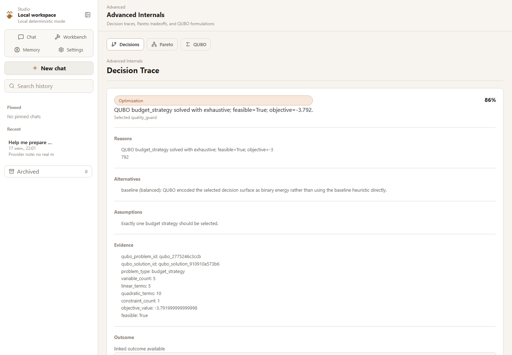
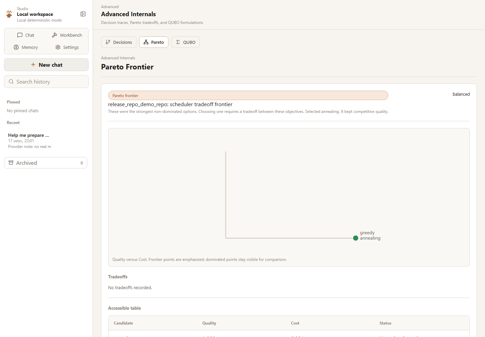
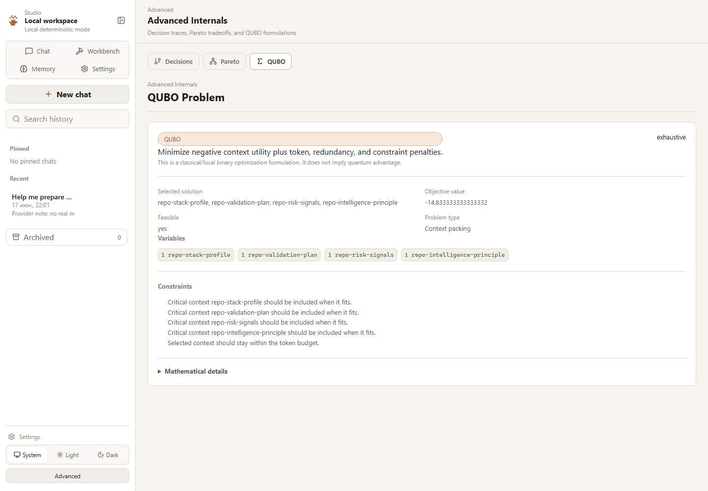

# Studio Advanced Views

Advanced views are deliberate secondary access. They exist for technical users
who want to inspect decisions and tradeoffs; they are not the main product.

## Decision Traces



Decision detail shows structured artifacts:

- decision;
- selected option;
- alternatives;
- reasons;
- assumptions;
- confidence;
- evidence;
- outcome;
- linked work;
- whether later evidence supported the decision.

It does not expose private chain-of-thought. Developer details can show safe
technical payloads when enabled, but giant JSON is not the default view.

## Pareto



Pareto views show candidate labels, objective axes, selected candidate,
dominated/non-dominated distinction, preference profile, tradeoff explanation,
and a table fallback.

Required framing:

```text
These were the strongest non-dominated options. Choosing one requires a
tradeoff between these objectives.
```

Pareto does not prove the objectively correct decision.

## QUBO



QUBO views lead with:

- what problem was formulated;
- what solution was selected;
- whether it improved anything;
- selected variables in human language;
- objective value;
- constraints;
- local solver used;
- comparison with a heuristic result when available.

Mathematical details stay collapsible. Current solvers are classical/local and
do not imply quantum advantage.

## API

```text
GET /api/advanced/decisions
GET /api/advanced/decisions/{trace_id}
GET /api/advanced/pareto/{frontier_id}
GET /api/advanced/qubo/{problem_id}
```
