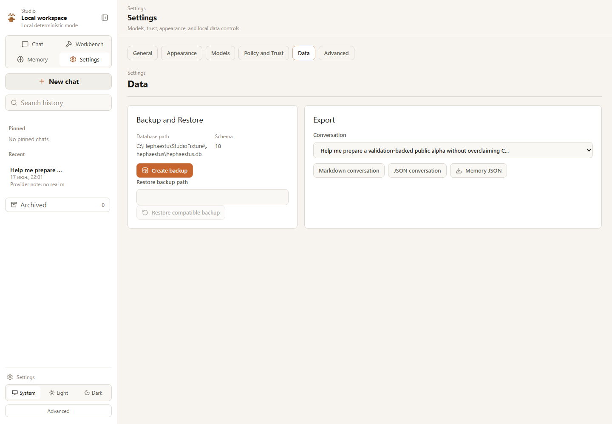

# Studio Backup And Export

Settings -> Data gives the user local data control without exposing secrets.



## Exports

Supported exports:

- conversation Markdown;
- conversation JSON;
- memory JSON;
- full local SQLite backup.

Conversation export preserves exact messages. It does not generate a model
summary. Markdown keeps message order, role, timestamp, and content including
code blocks.

Memory export includes regular and strategic memory detail without embeddings,
raw database payloads, or provider secrets.

## Backup And Restore

Full backup uses SQLite backup into the local `backups/` directory next to the
database. Restore requires explicit confirmation and refuses incompatible schema
versions rather than corrupting data.

Unsafe restore cases:

- missing file;
- non-file path;
- incompatible schema version;
- trying to restore the live database over itself;
- missing explicit confirmation.

## API

```text
POST /api/export/conversation/{session_id}
POST /api/export/memories
POST /api/backup
POST /api/restore
```

Exports do not include API keys.
