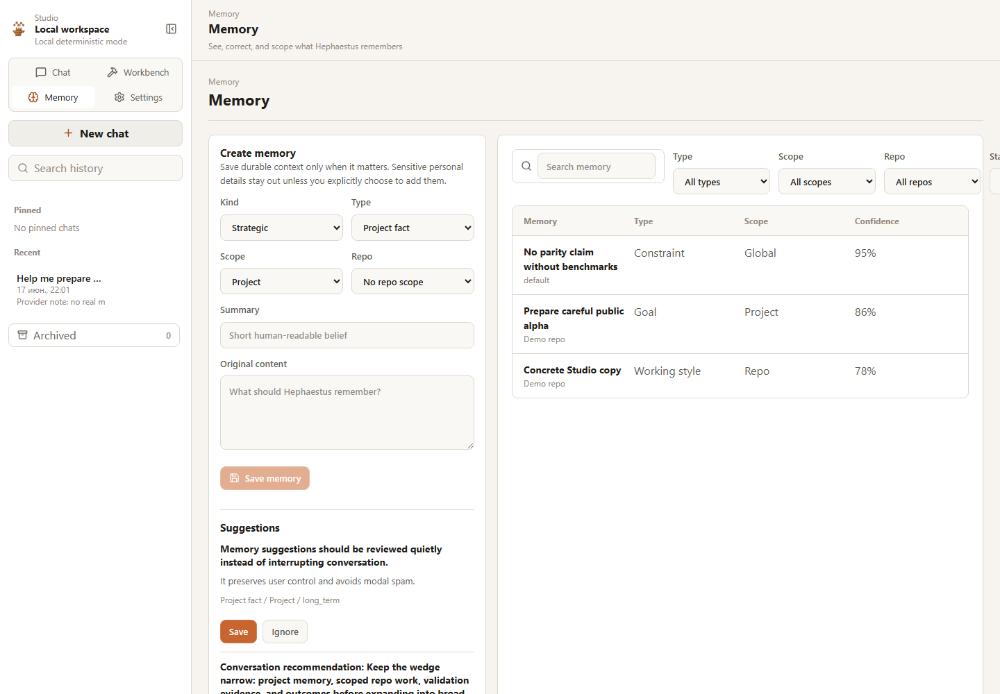

# Studio Memory

Studio Memory answers:

```text
What does Hephaestus remember, why, and how can I correct it?
```

It is not a surveillance profile. Conversation-derived memories stay as
suggestions until the user explicitly saves them.

## What It Shows

Memory combines regular memories and strategic memories with human labels:

- Goal
- Constraint
- Preference
- Principle
- Strategic decision
- Rejected path
- Lesson learned
- Open question
- Project fact
- Working style

List filters include search, type, scope, repo, and archive state. Detail views
show original content, concise summary, scope, type, confidence, importance,
source, evidence, linked conversation, linked work, conflict warnings, and
history when available.



## Actions

Users can:

- create memory;
- edit content, summary, type, scope, confidence, importance, stability, source,
  repo, and evidence;
- archive and restore;
- delete with explicit confirmation;
- resolve simple conflict warnings;
- save or ignore memory suggestions.

Sensitive personal details should never be auto-saved. They may appear as a
reviewable suggestion only when the user can decide whether they belong in local
memory.

## API

```text
GET    /api/memories
POST   /api/memories
GET    /api/memories/{memory_id}
PATCH  /api/memories/{memory_id}
POST   /api/memories/{memory_id}/archive
POST   /api/memories/{memory_id}/restore
DELETE /api/memories/{memory_id}
GET    /api/memory-suggestions
POST   /api/memory-suggestions/{suggestion_id}/save
POST   /api/memory-suggestions/{suggestion_id}/ignore
```

The frontend never queries SQLite directly and never displays embeddings or raw
database payloads.
