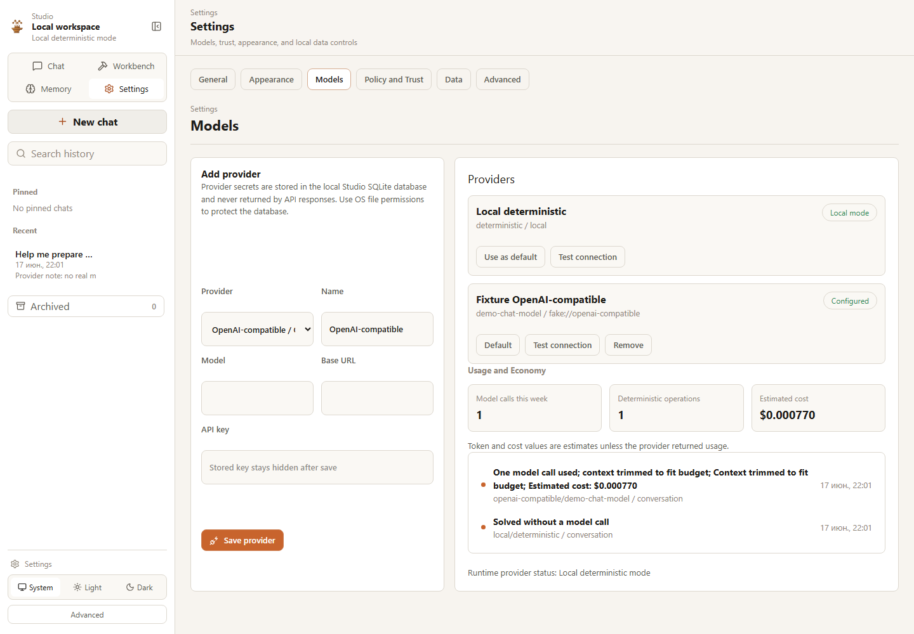

# Studio Model Settings

Settings -> Models is the local provider and usage surface. It is intentionally
restrained: configure a provider, test it, choose a default, and understand
rough usage.



## Providers

Supported paths:

- Local deterministic mode
- DeepSeek
- OpenAI-compatible
- OpenRouter through OpenAI-compatible base URL/model settings

Provider rows show name, model, base URL, configured state, connectivity state,
thinking and reasoning effort, maximum output tokens, intended roles, context
window, cost metadata, key source (never the key), and default conversation
provider.

Status language:

```text
Configured
Testing
Connected
Not configured
Connection failed
Insufficient balance
Local mode
```

For DeepSeek, choose `DeepSeek` to prefill `https://api.deepseek.com`,
`deepseek-v4-flash`, thinking enabled, and `high` effort. `Test connection`
makes one tiny request with no tools, repository context, conversation, or
memory. It reports provider/model/status/latency and maps authentication,
balance, rate-limit, timeout, and invalid-model failures to safe messages. It
never starts a coding smoke.

## Secret Handling

Stored API keys are never returned by normal API responses. Secret inputs are
write-only after save. Exports exclude provider secrets.
Remove the provider configuration to delete its saved key.

Current storage approach: provider secrets are stored in the local Studio
SQLite database and protected by OS file permissions. OS keychain integration is
future work.

## Usage Economy


The usage view shows:

- estimated model calls this week;
- deterministic operations;
- estimated input and output tokens;
- provider-reported input/output and cached input tokens when available;
- thinking state and reasoning effort;
- estimated cost when metadata exists;
- context trimming;
- provider/model used;
- task type and linked success/failure where available.

Heuristic token and cost values are estimates. Preferred user-facing messages:

```text
Solved without a model call
One model call used
Context trimmed to fit budget
Estimated cost: ...
```

Adaptive multi-model routing is not implemented in Phase 5.5C.

## API

```text
GET    /api/providers
POST   /api/providers
PATCH  /api/providers/{provider_id}
DELETE /api/providers/{provider_id}
POST   /api/providers/{provider_id}/test
GET    /api/usage
```
